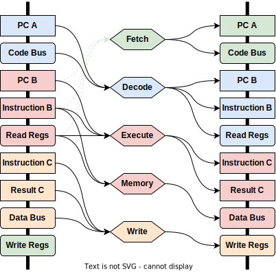

# Pinwheel
Pinwheel is a tiny (~500 line), debuggable RISC-V microcontroller core for hard-real-time FPGA-based applications. Pinwheel supports the baseline RV32I instruction set, and will eventually support the C (compressed) and M (multiplication) extensions.

Pinwheel supports 2-way simultaneous multithreading by interleaving pipeline stages between threads. The two active threads will generally be referred to below as the "primary" and "secondary" active thread, though there is no hardware difference between them. Up to N thread states can be "ready to run" at one time, where N is only limited by the size of the block RAM that you allocate to the register files (generally N is at least 8). Switching threads between active and ready takes only one (custom) instruction.

Pinwheel uses a Harvard architecture for its memory buses - code and data memories are physically separate and accessed over separate buses. Data memory can be read and written at any time, code memory can be executed from at any time and can be written (but not read) when the secondary thread is idle.

The arrangement of the pipeline stages and memory buses has a few interesting properties:

1. The primary thread can read and write from any ready thread's register file when the secondary thread is idle (meaning its program counter is set to 0).
3. The primary thread can debug and single-step the secondary thread by repeatedly pausing and unpausing it.
4. The primary thread can run a GDB server that controls the secondary thread, allowing for full-featured debugging without any additional hardware. (Not actually implemented yet)
5. Pinwheel does not implement interrupts. Instead, the primary thread can poll for interrupt-type events in a loop and then switch the secondary thread to an interrupt handler thread as needed. Since each ready thread has its own register file and (optionally) its own stack, this doesn't require saving and loading registers as a context switch would.
6. Similarly, Pinwheel can implement preemptive or cooperative multithreading by having the primary thread swap out the secondary thread at regular intervals.
7. Implementing quick-and-dirty software-defined peripherals on the secondary thread using bit-banging is easy and fully deterministic.
8. Other weird stuff yet to be determined.

Below is a diagram of how Pinwheel's pipeline stages and execution units are interconnected. The boxes on the left represent the current outputs from internal registers and memory buses, the hexagons represent execution units, and the boxes on the right represent the "next" state of the internal registers and buses.

Pinwheel uses a 4-cycle pipeline, with the usual "execute" and "memory" pipeline stages happening in the same cycle. Due to pipelineing Pinwheel executes one instruction per thread every 2 cycles, for an aggregate of 1 instruction per cycle.

During a clock cycle, Pinwheel is simultaneously:

1. Executing an instruction or reading/writing data memory for the primary thread.
2. Fetching the next instruction for the primary thread from code memory.
3. Writing the results of an instruction on the secondary thread to the register file.
4. Decoding the next instruction on the secondary thread.

Pinwheel's register memory requires 2 read ports and 1 write port. This can be implemented by hooking up two simple-dual-port block RAMs in parallel with the data duplicated between them. Each threads' register file requires 1024 (32*32) bits of storage, or 2048 bits including the data duplication.

On Xilinx devices, two 36 kilobit block rams can implement a register file large enough to store 32 threads' worth of state.

On Lattice iCE40 devices, each 4 kilobit block ram has a maximum width of only 16 bits. By joining 4 of them together, we have enough storage for 8 threads' worth of state.
